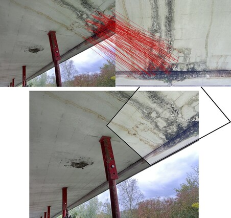

LiLoc: LiDAR Image Localization
=====

Scripts for localizing image sets in point clouds. Based on [XFeat and LighterGlue](https://github.com/verlab/accelerated_features).



## Installation
Clone the repository including submodules.

```bash
git clone https://github.com/RUB-Informatik-im-Bauwesen/LiLoc --recurse-submodules
```

Install the requirements.
For GPU support use the installation instructions from [pytorch.org](https://pytorch.org/get-started/locally/).

```bash
pip install torch torchvision torchaudio  # Replace with GPU versions from pytorch.org
pip install -r accelerated_features/requirements.txt
pip install -r requirements.txt
```

## Usage

*Quickstart:* Matches all images in a given folder and writes to `./example/defect_img/matches`

```bash
python liloc.py match ./example/defect_img/
```

To match all images from one folder against all images from another folder (e.g. camera photos against LiDAR photos).
```bash
python liloc.py cross_match ./example/scan_img/ ./example/defect_img/
```

For more flags and information use the help function:
```bash
python liloc.py match --help
python liloc.py cross_match --help
```

---

LiLoc can also extract rectified images from point clouds. 
```bash
python extract_images_from_e57.py pointcloud.e57
```
If there are no images, use the `--rgb` flag to render rectified images from the point cloud's rgb values.

## Paper

*To be published at ISARC 2025 in Montréal, Canada*

